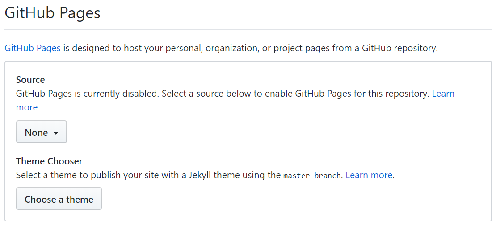
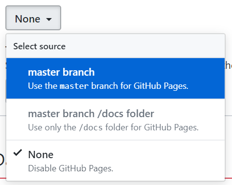

# html_study

## デモページ
https://html-study.netlify.com/

## 環境構築方法

1. Git for Windowsをインストール
1. GitHubアカウントを作成
1. GitHubの<a href="https://github.com/yfujii01/html_study">yfujii01/html_study</a>をforkする
1. ターミナルを開きGitHubからプロジェクトをcloneする
    ```
    $ git clone https://github.com/【自分のアカウント名】/html_study.git
    ```
1. VSCodeをインストール
1. VSCode拡張のLive Serverをインストール
1. index.htmlを右クリックしてOpen with Live Serverを選択

## ページ説明

* index.html  
各種ページへのリンク

* sample_js.html  
JavaScriptの実装サンプル

* sample_css.html  
CSSの実装サンプル

* sample_sendparam.html  
formをgetで送信するサンプル

* sample_getparam.html  
get送信されたパラメータを受け取るサンプル

* sample_ajax.html  
ajaxを使用したjson受信サンプル

* sample_layout.html  
よくあるサイト構成のサンプル

## 課題

1. 以下のサイトを真似して作ってみよう(※似たようなものができればOK)  
https://kyokou.netlify.com/
2. 作成したサイトに対するリンクをindex.htmlに作成すること
3. GitHubにpushしてGitHub Pagesの設定をして公開してみよう

## GitHub Pages公開手順

1. GitHubに変更をpushする  
```
$ git add -A
$ git commit -m '変更のコミット'
$ git push origin master
```

2. GitHubのリポジトリをブラウザで開く
3. タブからSettingsを選択  

4. GitHub Pagesの設定箇所までスクロール  

5. Sourceを「master branch」に設定  

